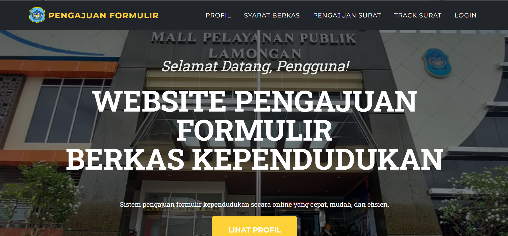
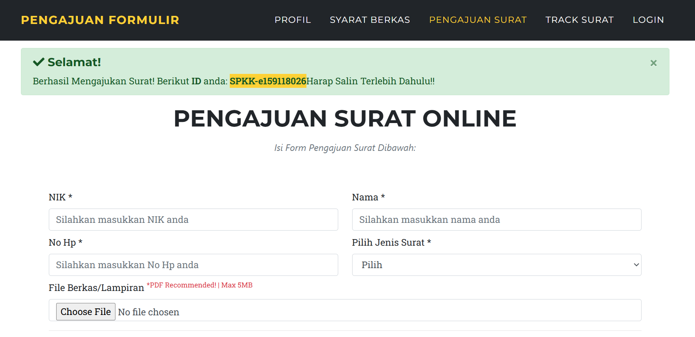
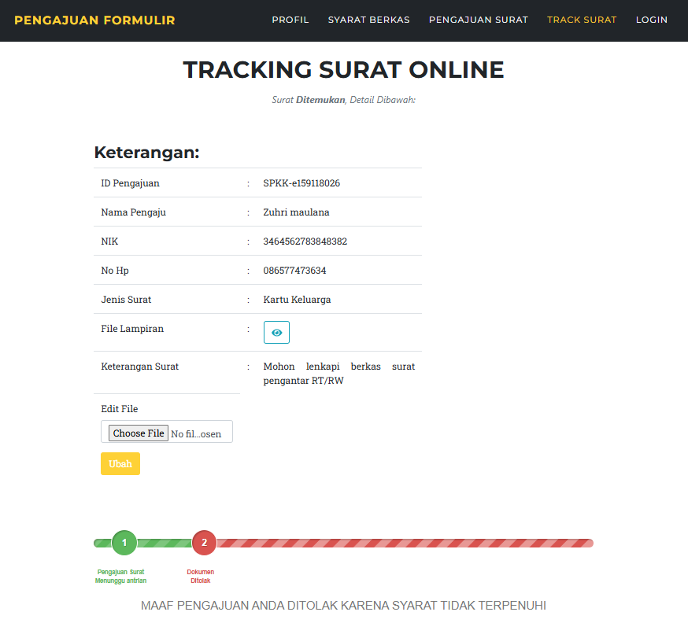

<h3 align="center">Sistem Informasi Pengajuan Surat dan Monitoring Surat Menggunakan codeigniter framework</h3>

## 🔄 Workflow / How It Works
1. **Document Submission**
   - Users submit population document requests by filling out an online form and uploading the required documents.

2. **Submission Confirmation**
   - After submission, the system displays a success notification along with a unique submission ID.
   - This ID must be saved by the user to track their request.
   - Submission status includes: Pending, Reviewed, Approved, or Revision Required

3. **Tracking System**
   - Users can track the status of their submission using the submission ID.
   - The system displays the current status and any updates from the admin.

4. **Admin Response**
   - Admin reviews submitted documents and provides feedback or updates regarding the request status.
   - If there are issues, the admin can send messages explaining what needs to be corrected.

5. **Document Revision**
   - Users can update or re-upload required documents if there are errors or missing requirements.
   - The system ensures continuous communication between user and admin until the process is completed.


## 📸 Screenshots
### Home Page


### Submission page


### Track page


### Admin page


## ⚙️ Installation & Setup
1. Clone this repository
```bash
git clone https://github.com/ZuhriSyafiq/formpeng
```
2. Move project to htdocs (XAMPP/Laragon)
3. Import database:
   - Open phpMyAdmin
   - Create new database (pkl.sql)
   - Import .sql file
4. Run in browser: http://localhost/nama-folder

